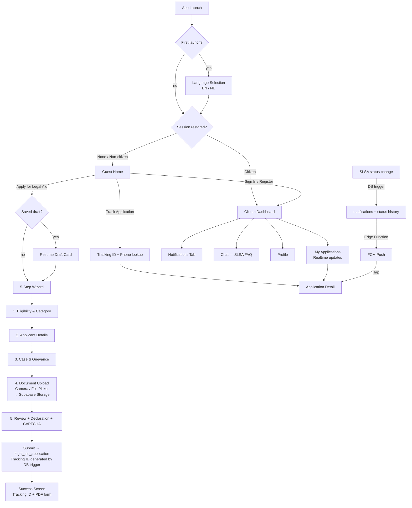

# Nyaya Saathi — Sikkim SLSA Legal Aid App

**Nyaya Saathi** (न्याय साथी — "Companion of Justice") is a cross-platform Flutter application built for the **Sikkim State Legal Services Authority (SLSA)**. It enables citizens of Sikkim to apply for free legal aid, upload supporting documents, track application status in real time, receive push notifications on status changes, and get instant answers to legal-aid FAQs — all in a multilingual, accessibility-first interface.

---

## 🎯 Purpose

Under the **Legal Services Authorities Act, 1987**, Sikkim SLSA provides free legal services to eligible citizens (persons with annual income below ₹3,00,000, women & children, SC/ST members, persons with disabilities, and victims of disasters/ethnic violence). Nyaya Saathi digitises the application journey end-to-end, replacing paper forms (A/B/C/D) with a guided mobile-first experience.

---

## ✨ Key Features

### 🏠 Citizen Public Experience (no login required)

- **Apply for Legal Aid** — A guided 5-step wizard (details in [Complete App Flow](#-complete-app-flow)) with **CAPTCHA-verified submission** and auto-generated **A4 legal-aid form PDF**.
- **Application Tracking** — Track any application _without an account_ using the **Tracking ID + registered phone number**.
- **Draft Resumption** — The in-progress application is auto-saved locally (Hive) after every step; users resume exactly where they left off, even after app restarts.
- **Bilingual onboarding** — English 🇬🇧 / Nepali 🇳🇵 selection on first launch.

### 👤 Citizen Account & Dashboard

- **Email/password authentication** (Supabase Auth) with **citizen-only role gating** — non-citizen accounts (advocates/officials) are auto-signed-out; suspended accounts are blocked.
- **Registration CAPTCHA** to prevent automated sign-ups.
- **Dashboard tabs** — Home, My Applications (live status badges), Notifications, Chat (SLSA FAQ assistant), plus a Profile screen.
- **Realtime updates** — Application list, detail, and status history refresh instantly via Supabase Realtime (Postgres Change Streams).
- **Push Notifications** — Firebase Cloud Messaging (FCM) with deep-linking: tapping a status notification opens the exact application detail screen.

### ⚖️ Advocate Preference (citizen-facing)

- Citizens can set a **preferred advocate** for their district (from `advocate_master` + `advocate_district_mapping`) while applying, and later raise an **advocate change request** (`advocate_change_request`, status `PENDING`). Dedicated advocate-side dashboards are **not** part of this app.

### 📄 Documents

- Upload via **file picker** or **in-app camera scanner** with image cropping.
- Files stream straight to **Supabase Storage** (`legal-documents` bucket) during the wizard and are linked to the application on submit.

### 🌍 Accessibility & Localisation

- **Bilingual** — English & Nepali (custom `AppLocalizations` + `assets/translations/`).
- **Light / Dark themes** (Material 3, Google Fonts — Inter/Outfit) with **adjustable font scaling** (small/medium/large).

---

## 🔄 Complete App Flow

### 1. Launch & Routing (`splash_screen.dart`)

```
App start
  ├─ Load .env (flutter_dotenv)
  ├─ Initialize Supabase (url + anon key from .env)
  ├─ Initialize Firebase + NotificationService (FCM permissions, channels)
  └─ MultiProvider wiring (Theme, Language, ApplyData, Draft, Auth, Application)
        ↓
Splash (1.4s animated logo; parallel init: language init → draft load →
session restore → min 2.5s delay)
        ↓
First launch? ── yes ─→ LanguageSelectionModal (English / Nepali, non-dismissible)
        ↓
Session restore result?
  ├─ 'citizen'     → CitizenDashboardShell (+ consume pending notification deep-link)
  ├─ 'non_citizen' → silent sign-out → UnauthHomeScreen
  └─ 'none'/error  → UnauthHomeScreen
```

### 2. Guest Home (`unauth_home_screen.dart`)

Hub for unauthenticated users (auto-redirects to the dashboard if a session exists):

- **Draft Resumption Card** — shown when a saved draft exists (resume or discard).
- **Apply for Legal Aid** → starts/resumes the wizard.
- **Track Application** → guest tracking.
- **Sign In / Create Account** → auth screens.

### 3. Legal Aid Application Wizard (`apply_flow/`, 5 steps)

Hosted in `ApplyWizardScreen` with an animated progress bar and an `IndexedStack` of steps. The current `stepIndex` is persisted after every navigation, so a draft always reopens on the right step.

| Step | Screen | What happens |
| ---- | ------ | ------------ |
| 1 | `Step1CategoryScreen` — *Eligibility Criteria* | Categories fetched live from `legal_aid_category` via `ApplyDataProvider` → `SupabaseApplyRepository`. Selecting the *Women & Children* category auto-sets gender to *Female*. |
| 2 | `Step2ApplicantDetailsScreen` — *Applicant Details* | Full name, gender, DOB (date picker), village/town, district (`district_master`), taluka (`taluka_master`), email, phone. **Prefilled from the logged-in user's `profiles` row** via `startNewDraft(profile: ...)`. |
| 3 | `Step3CaseTypeScreen` — *Case & Grievance* | Case type from `case_type_master`, grievance summary and relief sought. |
| 4 | `Step4DocumentUploadScreen` — *Document Upload* | Required documents = **union of `legal_aid_category_document_map` + `case_type_document_map`** for the chosen category/case type. Each document is captured via file picker or the camera scanner modal (`document_scanner_modal.dart` + `image_crop_editor.dart`) and **uploaded immediately** to the Supabase Storage bucket `legal-documents` at `draft-uploads/{draftUuid}/{docCode}.jpg` (upsert). |
| 5 | `Step5ReviewSubmitScreen` — *Review & Submit* | Full review, **declaration checkbox** must be accepted, and an in-app **CAPTCHA** must be solved. On submit: insert into `legal_aid_application` (a DB trigger generates the tracking number), then link each uploaded file into `application_document`. |

**After submit → `application_success_screen.dart`**: shows the generated **Tracking ID** (copy & share via `share_plus`) and entry points to tracking / dashboard.

**PDF**: `PdfGeneratorService.generateA4FormPdf(draft)` renders the application as a formatted **A4 legal-aid form** (Form A/B/C/D style, per Sikkim SLSA regulations) that can be printed/shared (`printing` + `share_plus`).

### 4. Draft Lifecycle (`DraftProvider` + `HiveDraftService`)

```
"Apply" tapped ─→ create draft (uuid v4 draftUuid, Hive-backed) ─→ every field edit auto-saves
      │                                                           (category, applicant, case,
      │                                                            grievance, docs, stepIndex)
      ├─ app killed/restarted ─→ loadDraft() at splash ─→ resume card on guest home
      ├─ successful submit ─→ draft cleared
      └─ discard ─→ Hive clearDraft()
```

### 5. Authentication Flow (`auth_provider.dart`)

- **Register** (`register_screen.dart`): email + password + **CAPTCHA validation** → Supabase `signUp`; the CAPTCHA refreshes on failure.
- **Login** (`login_screen.dart`): Supabase password sign-in → fetch `profiles` row → role gate:
  - `isCitizen == false` → error + **forced silent sign-out** ("Only citizens may use this application").
  - `isActive == false` → "account suspended" error.
  - Otherwise → profile cached, FCM token synced to backend, routed to dashboard.
- **Session restore** at splash from Supabase's persisted session (same role gate).
- **Auth listener**: on `signedIn`/`tokenRefreshed` → sync FCM token; on `signedOut` → clear profile.
- **Profile updates** (name, phone, email, DOB, gender, village/town, district) from `ProfileScreen` write back to `profiles`.
- Auth errors (invalid credentials, unconfirmed email, weak password, rate limits…) are mapped to friendly, localised messages.

### 6. Citizen Dashboard (`citizen_dashboard_shell.dart`)

Bottom navigation with 4 tabs + Profile:

| Tab | Details |
| --- | ------- |
| **Home** | Overview, quick actions, draft resumption. |
| **My Applications** | Submitted applications with live status badges (`status_badge.dart`); a **Realtime channel** on `legal_aid_application` refreshes the list instantly. Tap → `ApplicationDetailScreen`: status timeline from `application_status_history` (also Realtime-subscribed), documents, and **advocate change request**. |
| **Notifications** | In-app list from the `notifications` table (rows created by the DB trigger on every status change), with unread tracking. |
| **Chat** | SLSA FAQ assistant — canned answers on eligibility, costs, and documents, plus SLSA contact info (`sikkim_slsa@live.com`). |

### 7. Guest Tracking (`tracking_screen.dart`)

Enter **Tracking ID + registered applicant phone number** → `ApplicationRepository.trackApplication()` lookup → status badge + full `ApplicationDetailScreen`. **No account, no OTP.** Lookup attempts are recorded in `tracking_attempt_log`.

### 8. Notifications & Push Pipeline

```
SLSA staff update an application status (Supabase dashboard / ops tool)
  └─ DB trigger fn_handle_application_status_change
       ├─ inserts row into application_status_history
       └─ inserts row into notifications (for the applicant)
            └─ calls Supabase Edge Function send-fcm-notification (Deno;
               resolves FCM OAuth token from service-account secrets)
                 └─ Firebase Cloud Messaging → device
                      ├─ Foreground  → local heads-up notification
                      │   (channel: high_importance_channel, sound + vibration)
                      └─ Background/Terminated → system notification
                           └─ Tap → payload application_id / tracking number
                                (regex fallback: SK|LA|APP-…)
                                → navigatorKey deep-link → ApplicationDetailScreen
                                (queued as pending if the navigator isn't ready,
                                 consumed after the dashboard mounts)
```

### 9. Application Status Lifecycle

Stored on `legal_aid_application.status` (DB-enforced `CHECK` constraint) and recorded in `application_status_history`:

```
SUBMITTED ─→ UNDER_REVIEW ─→ ADVOCATE_ASSIGNED ─→ RESOLVED
                  │
                  ├──→ REJECTED
                  └──→ WITHDRAWN (citizen request)
```

### 10. End-to-End Journey Diagram



---

## 🏗️ Architecture

```
lib/
├── main.dart                          # Entry: dotenv, Supabase, Firebase init, provider wiring
├── core/
│   ├── config/supabase_config.dart    # Reads SUPABASE_URL / SUPABASE_ANON_KEY from .env
│   ├── constants/app_colors.dart      # Design tokens (primary blue, gold, semantic colors)
│   ├── localization/                  # Custom AppLocalizations (en/ne delegates)
│   ├── services/
│   │   ├── supabase_service.dart      # Icon resolver helper (mock data removed)
│   │   ├── hive_draft_service.dart    # Local draft persistence (Hive + uuid)
│   │   ├── notification_service.dart  # FCM + local notifications + deep-link routing
│   │   └── pdf_generator_service.dart # A4 legal-aid form PDF generation
│   └── theme/app_theme.dart           # Material 3 light/dark themes with Google Fonts
├── data/
│   ├── local/                         # Static option lists (caste, gender, fallback data)
│   ├── models/                        # District, taluka, document mapping, gender option
│   └── repositories/
│       ├── apply_repository.dart      # Master-data interface (categories, case types, docs…)
│       ├── supabase_apply_repository.dart
│       └── application_repository.dart # Submit / track / upload / realtime subscriptions
├── models/                            # Application, draft, profile, chat, notification, advocate…
├── providers/                         # ChangeNotifiers: Auth, Application, ApplyData, Draft, Theme, Language
├── screens/
│   ├── splash/                        # Animated splash + routing
│   ├── onboarding/                    # Language selection modal, SLSA info modal
│   ├── auth/                          # Login (email/password), Register (email/password + CAPTCHA)
│   ├── apply_flow/                    # Wizard shell, 5 step screens, success screen
│   └── citizen/                       # Dashboard shell, 4 tabs, profile, tracking, detail screens
└── widgets/                           # CAPTCHA box, document picker/scanner, crop editor,
                                       # draft resumption card, status badge, choice modal…
```

---

## ☁️ Backend (Supabase + Firebase)

### Supabase (`supabase/v3/schema.sql`, `supabase/v3/data.sql`, `supabase/migrations/`)

- **Master data** — `state_master`, `district_master`, `taluka_master`, `legal_aid_category`, `case_type_master`, `document_master`, plus `legal_aid_category_document_map` / `case_type_document_map` mapping tables.
- **Users & roles** — `roles`, `profiles` (citizen role + active flag used for login gating), `citizen_details`, `advocate_master`, `advocate_district_mapping`.
- **Applications** — `legal_aid_application` (tracking number generated by a DB trigger; `applicant_id` auto-linked when logged in), `application_document`, `application_status_history`.
- **Tracking & messaging** — `tracking_attempt_log`, `notifications`, chat infrastructure.
- **Citizen requests** — `advocate_change_request` (raised from the application detail screen).
- **Storage** — bucket `legal-documents` (`draft-uploads/{draftUuid}/{docCode}.jpg`).
- **Realtime** — Postgres Change Streams on `legal_aid_application` and `application_status_history`.
- **Edge Function** — `supabase/functions/send-fcm-notification/` (Deno) signs FCM OAuth tokens from service-account secrets and fans status-change notifications out to devices.
- **Triggers** — `fn_handle_application_status_change` records status history + creates notifications on every status change.

> 💡 Firebase init is wrapped in a try/catch, so the app still runs (without push notifications) if Firebase isn't configured.

---

## 🛠️ Tech Stack

| Layer | Technology |
| ----- | ---------- |
| **Framework** | Flutter (Dart SDK ^3.12.2) |
| **State Management** | Provider (`ChangeNotifier` + `ChangeNotifierProxyProvider`) |
| **Backend / Auth** | Supabase (`supabase_flutter`) — Auth, Postgres, Storage, Realtime, Edge Functions |
| **Push Notifications** | Firebase (`firebase_core`, `firebase_messaging`) + `flutter_local_notifications` |
| **Local Persistence** | Hive, SharedPreferences |
| **PDF Generation** | `pdf`, `printing`, `share_plus` |
| **Document Capture** | `file_picker`, `camera`, `image` (cropping) |
| **Configuration** | `flutter_dotenv` (`.env`) |
| **Localisation** | `flutter_localizations`, `intl`, custom JSON assets |
| **Theming & Fonts** | Material 3, `google_fonts` (Inter / Outfit) |
| **Misc** | `uuid`, `path_provider`, `flutter_spinkit`, `flutter_launcher_icons`, `flutter_native_splash` |

---

## 🚀 Getting Started

### Prerequisites

- Flutter SDK (Dart `^3.12.2` or compatible)
- A **Supabase project** with the schema from `supabase/v3/schema.sql` + seed data (`data.sql`) applied
- A **Firebase project** with FCM enabled (optional — the app runs without it, minus push notifications)

### Installation

```bash
# 1. Clone the repository
git clone https://github.com/pranaigiri/nyaya-saathi-ui.git
cd nyaya-saathi-ui

# 2. Install dependencies
flutter pub get

# 3. Configure environment
#    Create a .env file in the project root (already asset-bundled in pubspec.yaml):
#      SUPABASE_URL=<your-supabase-project-url>
#      SUPABASE_ANON_KEY=<your-supabase-anon-key>

# 4. Configure Firebase (Android: google-services.json in android/app/,
#    iOS: GoogleService-Info.plist) if push notifications are needed.

# 5. Run the app
flutter run
```

### Platform Targets

Configured for **Android**, **iOS**, **Web**, **Windows**, **Linux**, and **macOS** (push notifications currently target Android/iOS).

---

## 🧪 Testing

```bash
flutter test
```

Tests cover draft persistence and basic widget rendering (`test/draft_provider_test.dart`, `test/widget_test.dart`).

---

## 📁 Project Assets & Scripts

- `assets/images/` — app logo, splash logo, SLSA emblem, and other branding assets.
- `assets/translations/` — `en.json` and `ne.json` locale strings.
- `scripts/update_logo.py` — utility for regenerating app icons/splash from the source logo.
- `supabase/v3/` — full schema + seed data; `supabase/migrations/` — incremental SQL (status notifications); `supabase/functions/` — FCM Edge Function.

---

## 📜 Legal & Compliance Documents

- [PRIVACY_POLICY.md](PRIVACY_POLICY.md)
- [TERMS_OF_SERVICE.md](TERMS_OF_SERVICE.md)

---

## 📄 License

This project is for internal / government use by the Sikkim State Legal Services Authority.  
_Legal Services Authorities Act, 1987_ — Free legal aid for the citizens of Sikkim.